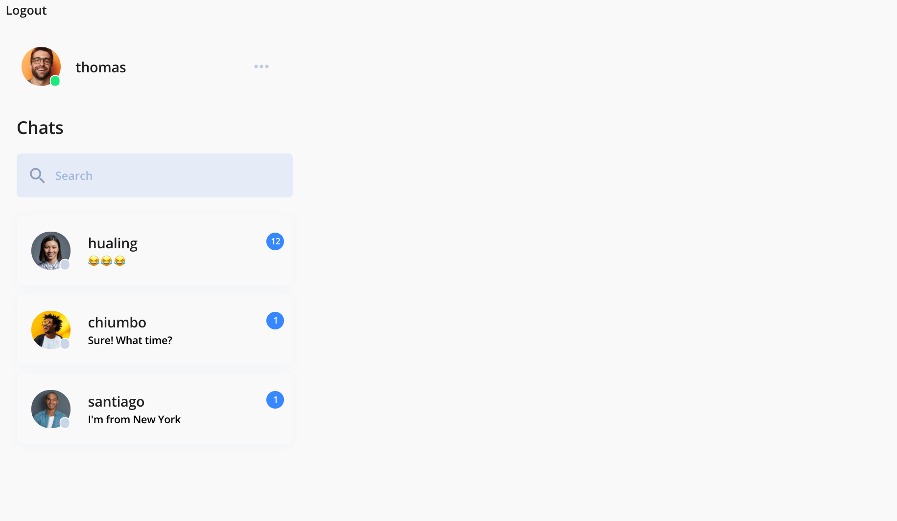
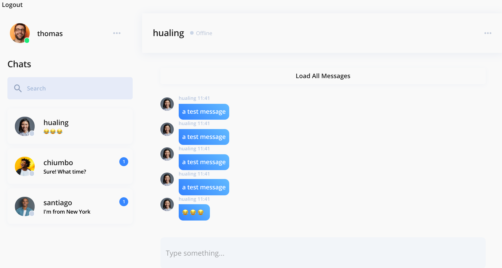
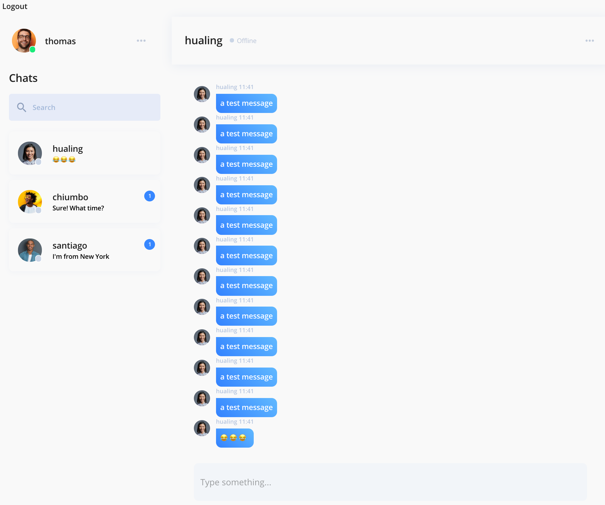
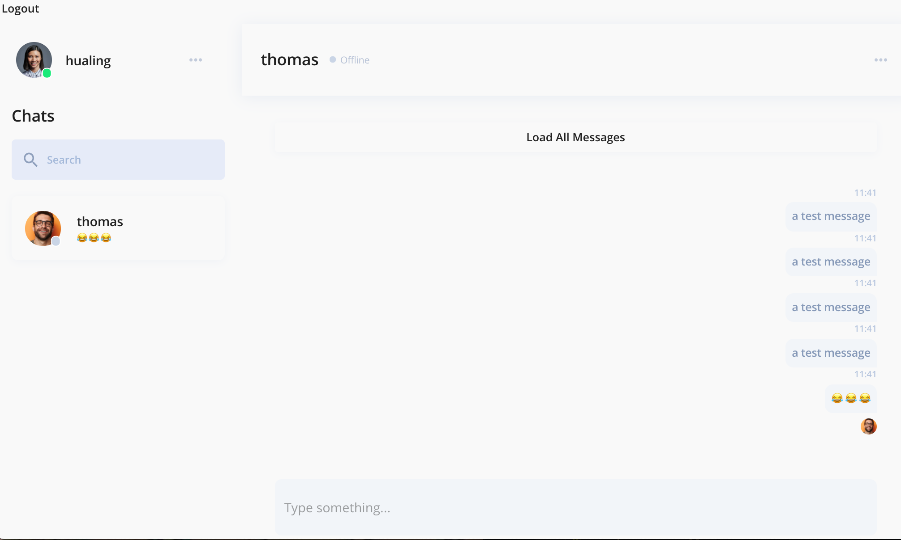

# Chatterbox

Chatterbox is a one-to-one realtime chat app built using Socket.IO, React, React Redux, Redux Thunk, Express.js, PostgreSQL, and JavaScript. This app was created as part of a group project.

View the live site here: https://chatterbox-messenger.herokuapp.com/

To test the app, login with either of these accounts:

username: thomas  
pw: 123456

username: hualing  
pw: 123456


## Images
See conversations with notification counts:


For efficiency, initially only load the most recent messages in the conversation:


Option to load full conversation history: 


If message has been seen by the other user, include their icon below the most recent message:



## Code Snippets

Store online users in a Map object:

```
const userSocketIdMap = new Map();
module.exports = userSocketIdMap;
```
On login: 
```
socket.on("go-online", (id) => {
    const addClientToMap = (id, socketId) => {
        if (!userSocketIdMap.has(id)) {
        userSocketIdMap.set(id, new Set([socketId]));
        } else {
        userSocketIdMap.get(id).add(socketId);
        }
    };
    addClientToMap(id, socket.id);
    socket.broadcast.emit("add-online-user", id);
});
```
On logout:
```
socket.on("logout", (id) => {
    const removeClientFromMap = (id, socketId) => {
        if (userSocketIdMap.has(id)) {
        let userSocketIdSet = userSocketIdMap.get(id);
        userSocketIdSet.delete(socketId);
        if (userSocketIdSet.size === 0) {
            userSocketIdMap.delete(id);
            socket.broadcast.emit("remove-offline-user", id);
        }
        }
    };
    removeClientFromMap(id, socket.id);
});
```

## To-Do
* Add new conversation
* Additional styling on register/login
* Mobile-responsive
* Show ellipses in chat/active chat preview if a user is typing

## Local Setup Instructions

Create the PostgreSQL database (these instructions may need to be adapted for your operating system):

```
psql
CREATE DATABASE messenger;
\q
```

Update db.js to connect with your local PostgreSQL set up. The [Sequelize documentation](https://sequelize.org/master/manual/getting-started.html) can help with this.

Create a .env file in the server directory and add your session secret (this can be any string):

```
SESSION_SECRET = "your session secret"
```

In the server folder, install dependencies and then seed the database:

```
cd server
npm install
npm run seed
```

In the client folder, install dependencies:

```
cd client
npm install
```

### Running the Application Locally

In the root directory:

```
npm run runDev
```
